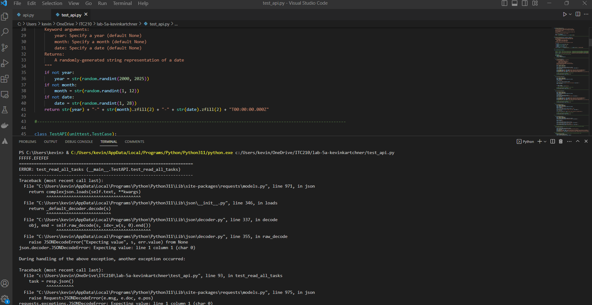
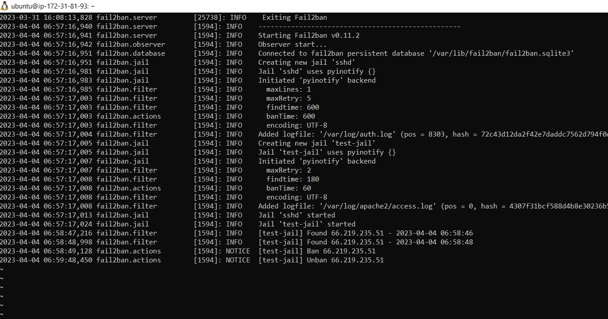
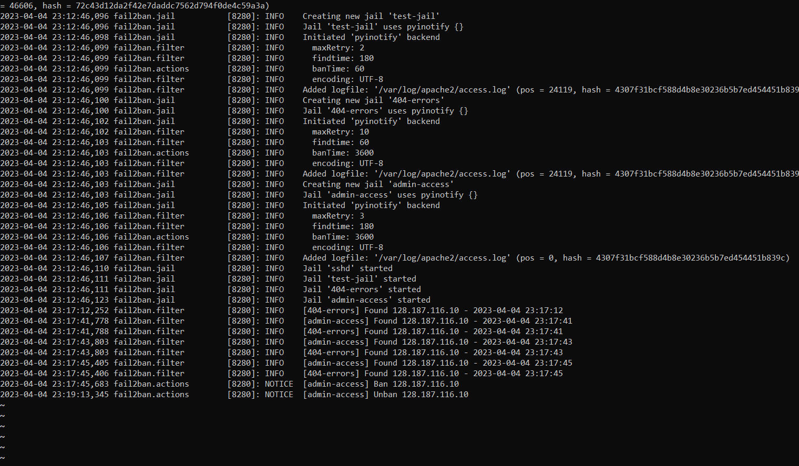

Gideion Prabhudas

April 5, 2023

 

# <strong>Lab 5 - Python and Unit Testing | Server Hardening and Regex</strong>

 

# Executive Summary
I learned how to use python for unit testing. In which it included using the cookie value of the website to test the API is a way to ensure that the API endpoint is properly authenticated and authorized to access certain resources. I also learned how to harden a server to protect it against password brute-forcing. Using Regex, I parsed through logs looking for specific phrasing and IP addresses to monitor a system's security and ban those IP addresses that were doing some suspicious activity.

 

# Design Overview

In lab 5a, I created the CRUD functionality(create, read, update, delete) or the POST, GET, READ and DELETE operations to send the requests to the HTTP. For every function, we have URL specified with a pre-authorized cookie, data variable is a JSON-encoded string, The headers variable contains the Content-Type and Cookie headers needed to authenticate the request, requests.request() function that interacts with the API and returns a response. Using the test_api.py file that contains the helper functions and test cases for an API that creates, reads, updates, and deletes tasks. It is where we test the functions created in api.py to see if they are working properly for the API. In lab 5b I created 2 custom fails that triggered with the help of fail2ban to ban IP addresses that were suspicious. I also created a custom python action script to inform me of IP addresses that are banned.

## `api.py`
Contains a class that provides methods for creating, reading, updating, and deleting tasks as well as reading information about the current user.

## `test_api.py`
Contains unit test script using the unitTest module to test the API class from the api.py file.

## `Jail-test.conf`
Contains a expression pattern(to look for hacker) that Fail2Ban will use to identify failed login attempts or other malicious activity

## `404-error.conf`
Contains a regex that will match any log line that contains the IP address of the client and the "404" error code.
 
## `admin-access.config`
Contains filter that will use a regex to match the admin page URL, and exclude the IP address of the admin user.

## `myaction.py`
Contains a python script action that is triggered to send an email when there is a malicious activity

## `myaction.conf`
Contains actions to that Fail2Ban will use to ban an IP when jail is triggered 

## `Screenshots`
### Displays the Unit test of the APIs

### Test-jail for banning IP addresses when URL contains /hacker

### Custom test jail for 404-error and admin page when jail is triggered

### Email sent by python when action is triggered

 

# Questions

### 5a Question 1: Name and discuss at least two of the benefits of writing unit tests before writing code?
>* Helps to ensure code correctness and maintainability:
When you write unit tests before writing the code, it forces you to think through the functionality of the code you are going to write. This results in better code design and helps you to identify any potential issues in the logic or architecture of your code before you write the actual code. Unit tests provide feedback on whether your code is behaving as expected or not. This helps you to detect and fix issues early on, reducing the likelihood of bugs and making the code more maintainable in the long run.

>* Saves time in the long run:
Although writing unit tests requires more upfront work, it can save time in the long run by reducing the time spent on debugging and fixing issues. When you write unit tests, you can catch any issues early on, which saves you time and resources that you would otherwise have spent debugging or fixing the issues. Additionally, unit tests help to ensure that any changes made to the codebase do not break existing functionality, making it easier to maintain and update the code in the future. By writing unit tests, you can be more confident that your code is working correctly, which helps to reduce time spent on debugging and maintenance in the long run.

### 5a Question 2: What would be some of the benefits of automating your test scripts (i.e. so they run at each commit)?
> Some benefits of automating test scripts so that they run at each commit are:
>* It allows for faster and more frequent feedback on the quality of code being pushed to the repository. This enables developers to catch and fix issues earlier in the development cycle, reducing the overall cost of fixing bugs.
>* Automated testing also ensures consistency in the execution of test cases, eliminating any potential human error that could lead to false positives or negatives.
>* Automating test scripts reduces the time and effort required for manual testing, freeing up resources to focus on other critical aspects of software development.
>*  Enables better collaboration among team members, as it provides a shared understanding of the expected behavior of the software being developed. 
>* Automated testing promotes continuous integration and deployment, allowing for more frequent releases of new features and improvements to existing software.

### 5a Question 3: How long did this lab take for you?
> I spent around a total of three days to get both the labs done.

 

# Lessons Learned
## Lesson 1: Assertion-errors
Assertion errors occur when an assert statement fails. This can happen when the actual output of a function does not match the expected output. To solve an assertion error, use a debugger to step through your code and see where the assertion error is occurring. This can help you identify the source of the error and correct it. Also using print statements to print out intermediate values and see what is happening at each step of your code. It can identify where the error is occurring and what values are causing it.

## Lesson 2: [1916]: ERROR Sorry but the jail <jail-Name> does not exist
This error occurs when Fail2Ban is unable to find or load the configuration file for the jail named. If there are errors in the configuration file, Fail2Ban may not be able to load the jail. To solve this error, check the syntax of the configuration file using the fail2ban-client check command to see if there are any errors. Restart the Fail2Ban service using the systemctl restart fail2ban command to apply any changes you made to the configuration file. Also check the Fail2Ban log files to see if there are any error messages related to the custom jail, and troubleshoot. In this case the fail to failregex was not defined properly. Using an online regex tester, like `regex101.com` can help test to see if your expression is right. 

## Lesson 3: shebang error
The shebang line in Python is used to indicate the location of the Python interpreter that should be used to execute the script. The shebang line should be placed at the beginning of the Python script. However, if the Python interpreter is not installed in the default location you may encounter an error. To fix this error, check the location of the Python interpreter on your system and update the shebang line to point to the correct location. During the installation process begins make sure you check the box that says, "add `exe` to path". Also install the correct version of Python on your system and update the shebang line to point to the correct location.

 

# Conclusions

## Skills Acquired
* I can unit test different APIs using Crud operation
* I can script different assert methods which is used as the error message on failure of an API.
* I can custom create a jail configure file to ban IP addresses from malicious activity
* I can use python to trigger actions and inform me of IP addresses that are banned due to suspicious activity

 

# References
* https://docs.python.org/3/library/unittest.html
* https://www.programiz.com/python-programming/pass-statement
* https://www.digitalocean.com/community/tutorials/how-to-protect-ssh-with-fail2ban-on-ubuntu-20-04
* http://toon.io/fail2ban-send-sms-user-banned/