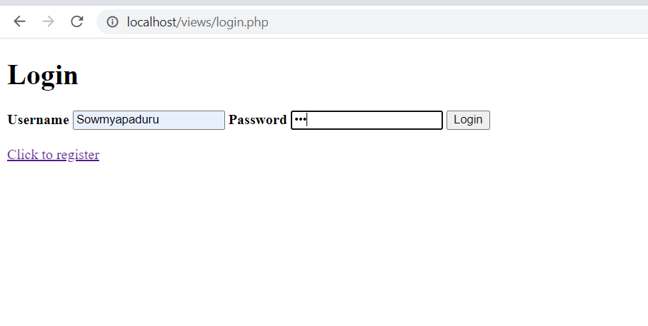
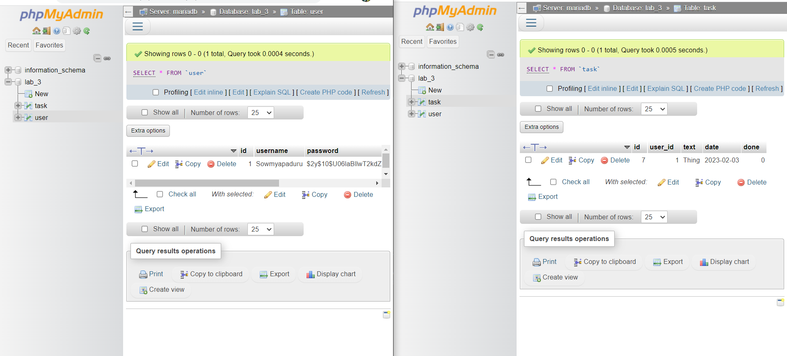

Gideion Prabhudas

February 2, 2023

 

# <strong>Lab 3 - PHP rgistration, login and CRUD Operation</strong>

 

# Executive Summary
In this lab, PHP a general-purpose scripting language was used to create a registration and a login form for users. It invloed connecting the PHP to a database in which we have our users information saved, retried and validated during the registration and a login process. We also used PHP to create CRUD opertation to have tasks inputed saved, read, updated and deleted by the user and saved to the database by using the Users session Id. 

 

# Design Overview

### UML of PHP registration and Login form operation using sql database

### UML of PHP CRUD operations using using sql database

## `index.php`
Contanins tasks of the logged in user

## `register.php`
Contains a form to enter new user details

## `login.php`
Contains log in form to enter user credentials

## `registration_action.php`
Contains actions to create a user, validates username if exsits and password with confirm password and saves new user details to the database

## `login_action.php`
Contains actions to log in an user. Validates username and passsword using the database and enters logs in the user to index.php

## `logout_action.php`
Contains action that Logs out the user by closing the session or destroying the session and redirects user back to login page

## `create_action.php`
Contains action to create tasks inputed by the user by using the session id in the index.php file and saves tasks to database

## `update_action.php`
Contains action to update task in the database by changing its value if user clicks on the checkbox 

## `delete_action.php`
Contains action to delete the tasks of the user in the database by using the users id 

## `.env`
contains Environment variables to establish connection to the database 

## `docker-compose.yaml`
Contains configuration details to connect to the database 

## `stylesheet.css`
contains code to style the website

## `Screenshots`
### Displays the registration page to create new user(username,password,confirm password)

### Displays login page for users input to login(username, password)

### Index page/logged in page that displays tasks

### Database of user and tasks table

 

# Questions

### 3a Question 1: Describe how cookies are used to keep track of the state. (Where are they stored? How does the server distinguish one user from another? What sets the cookie?)
> Cookie store a set of user specific information, such as a reference identifier for a database record that holds customer information. Users don't need to enter their 
information again for each page they visit because the Web server embeds the cookie into their web browser, making it available to other pages on the website. Cookies are a great way to collect customer information for online purchasing, to remember a user's preferences, or to keep track of a user's current state. Cookies are only stored on the client-side machine. Cookie stores session identifier. Each identifier is unique string of characters that differentiates between users.  With each request, that identifier is sent to the server. The server looks at it and checks whether it matches any session it stores. If it does, the user is identified and session data are loaded. A web server typically uses the response Set-Cookie HTTP-header to set cookies. Then, using the Cookie HTTP-header, the browser automatically adds them to the same domain using the Cookie HTTP-header.

### 3b Question 1: Describe how prepared statements help protect against SQL injection, but not XSS?
> Prepared statements, also known as parameterized statements or parameterized queries, are queries that are built up by a template query and then have data inserted afterward. Separating query command from data can prevent SQL injection problems. With prepared statements, data entered by a potential hacker is regarded as data and cannot be mingled with the SQL of your application or be understood as SQL. This is so that the query may be executed more quickly. Prepared statements "prepare" the SQL query first to determine the most effective query plan, and then send the actual values that are presumably entered into a form afterwards.Unlike SQL injection, which can be avoided by using prepared statements correctly, there is no single strategy or standard for preventing cross-site scripting attacks.

## 3b Question 2: Describe at least two key differences between the PHP version of the task list and the JavaScript one you completed in labs 2A and 2B?
>*  PHP stores data in the database using SQL
>*	JavaScript stores data in the browser local storage 
>*	In PHP, a variable is declared using a $ sign followed by the variable name.
>*	In JavaScript, a variable can be declared using var, let, const key word

### 3b Question 3:If we created a new table login_logout in the database to keep track of login and logout times of our various users, what would that table's schema look like? 
>      user_id         varchar2(30),           Primary 
       session_id       int(8),                unique
       host           varchar2(30),
       last_program   varchar2(48),
       last_action    varchar2(32),
       last_module     varchar2(32),
       logon_day        date,
       logon_time      varchar2(10),
       logoff_day       date,
       logoff_time      varchar2(10),
       elapsed_minutes   int(8)
) 

### Describe necessary fields, which fields would need to be primary or unique, and what data type you would use for each?
>       | Name        | Type      | Length/Values  | Default         | Index   | A_I |  ...  |
        | ----------- | --------- | -------------- | --------------- | ------- | --- | ----- |
        | `id`        | `INT`     |  `11`          | ...             | Primary |  ☒  |  ...  |
        | `user_id`   | `INT`     |  `11`          | ...             | Unique  |  ☐  |  ...  |
        | `logged_in` | `BOOLEAN` |                | `As defined: 0` | ...     |  ☐  |  ...  |
        

 

# Lessons Learned
## Lesson 1: error with $mysql_servername(.env file) 
A simple text configuration file for controlling your Applications environment constants. They can contain sensitive information like database passwords, API keys, and other credentials that should not be accessible to others. The also contain the server name that helps establish the connection to the database. The problem was the $mysql_servername on the .env file was named with local host instead of mariadb hence it didnt not match the confugurations on the docker-compse.yaml.(the local host name for the $mysql_servername was for the production environment. By changing the `$mysql_servername = mariadb` on the `.env file`, we could access the database and php files.

## Lesson 2: Prepared statements was not sending data to the database
The prepared statement is a PHP function that allows programmers to write code that our database can execute multiple times in an efficient manner. Security, query time, and server request size are all taken into account when communicating with your database. Sometimes the prepared statements can return false and input a bunch of error message.To effiectiely use prepared statements, we can have them nested in an `if statement` that checks each statement returns true and sends the data to the database but if false connection is failed. Having property named `$mysqli -> error and $stmt -> error` can greatly help with debugging when learning to use prepareed statement.

## Lesson 3: phpMyAdmin 404 Not Found Error on Production Environment
 phpMyAdmin  on the production server crashed and displayed error 404. This happnes when installing a new phpmyadmin, or anything at all that refreshes the state of the 
 apache.conf, and there is usually need to retrace all previous manual inclusions in the config file. Hence, given that when phpmyadmin is installed, we need to add a line in the`/etc/apache2/apache2.conf`. Hence, running the command `sudo nano /etc/apache2/apache2.conf` and the including the following line at the end of the opened config file `Include /etc/phpmyadmin/apache.conf` usually solves this problem. Lastly we need to create a link between files by `sudo ln -s /etc/phpmyadmin/apache.conf /etc/apache2/conf-available/phpmyadmin.conf`, enable the phpmyadmin `sudo a2enconf phpmyadmin.conf` and restart apache2 service for the new configuration to take place `sudo service apache2 reload`.

 

# Conclusions

## Skills Acquired
* I can Store data in database
* I can create a registration and login form using php and hash passwords
* I can use php to create a CRUD opertation 
* I can Sanitize inputs and use prepareed statements to protect against Cross-Site scripting attacks
* I can have the value change in the logged_in field in the database when the user logs in and out

 

# References
* https://www.tutorialrepublic.com/php-tutorial/php-mysql-login-system.php
* https://phppot.com/php/php-crud-with-mysql/
* https://www.w3schools.com/php/php_mysql_create.asp
* https://codereview.stackexchange.com/questions/278530/functions-in-php-to-run-basic-mysql-crud
